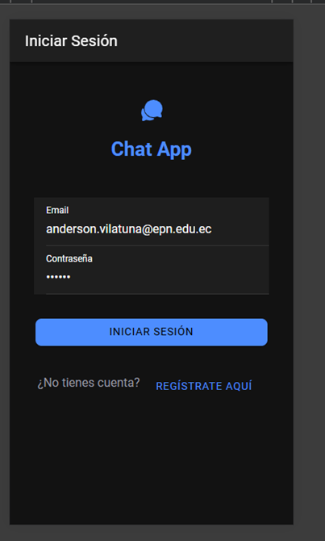
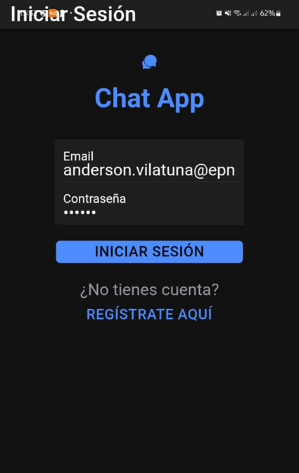
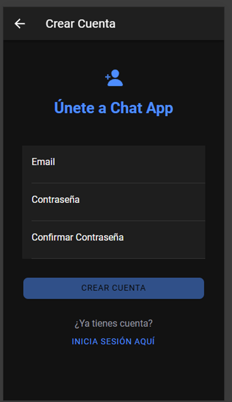
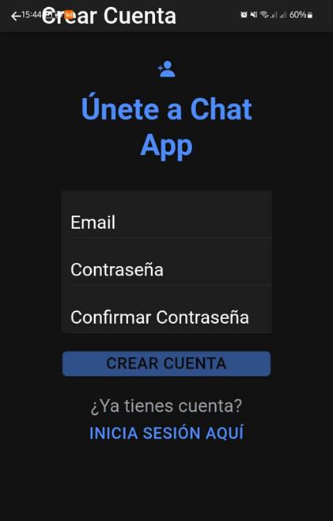
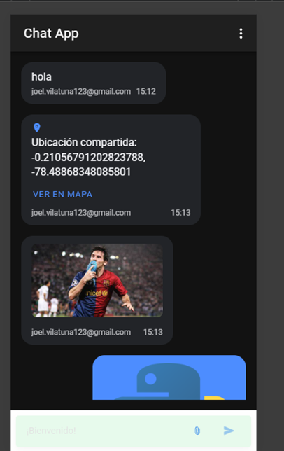
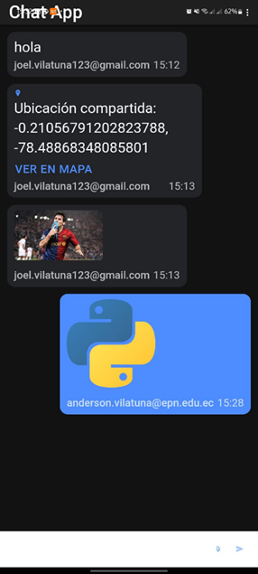
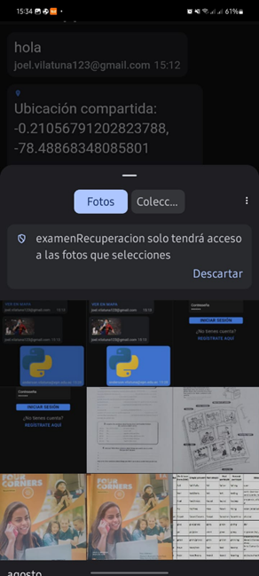
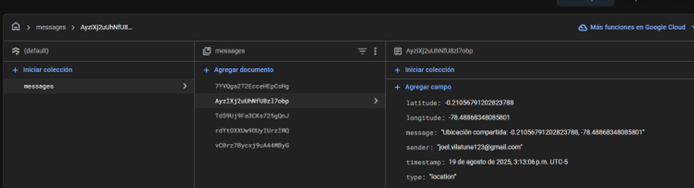
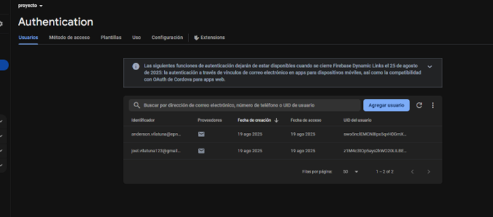

# Chat App - Examen de Recuperación

Aplicación de chat con Firebase, Ionic y Angular.

## Funcionalidades

✅ **Login y Registro** - Crear cuenta e iniciar sesión  
✅ **Chat en tiempo real** - Enviar mensajes instantáneos  
✅ **Enviar fotos** - Tomar fotos o seleccionar de galería  
✅ **Compartir ubicación** - Enviar tu ubicación GPS  
✅ **Ver mapas** - Abrir ubicaciones en Google Maps  
✅ **Borrar historial** - Limpiar todos los mensajes  

## Desarrollador

Anderson Joel  

Login
  	 

Registro
](image-2.png)

Chat

Subir una foto

FIRESTORE
Colecciones

Authentication
